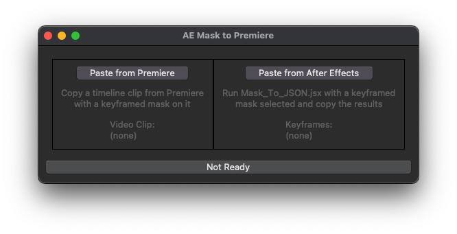
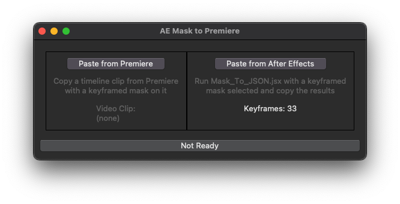
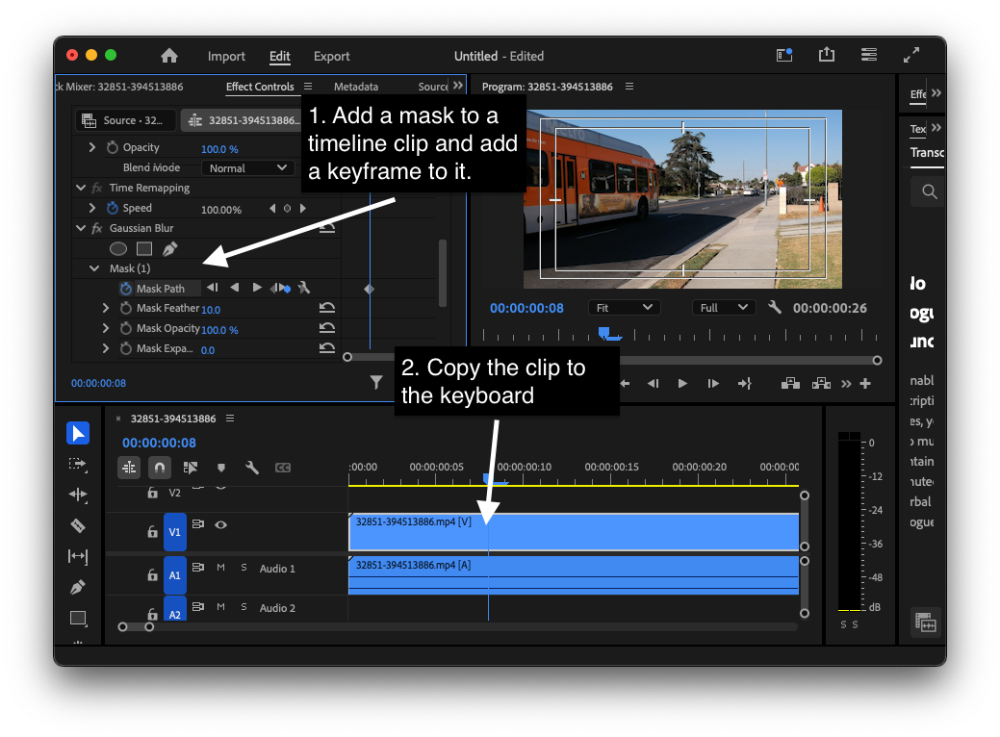
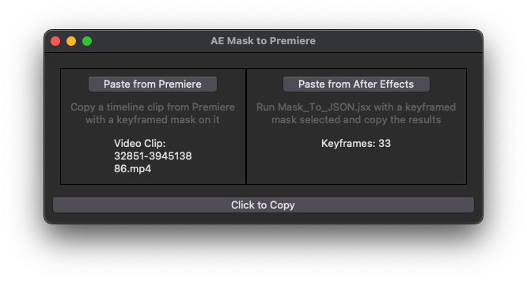
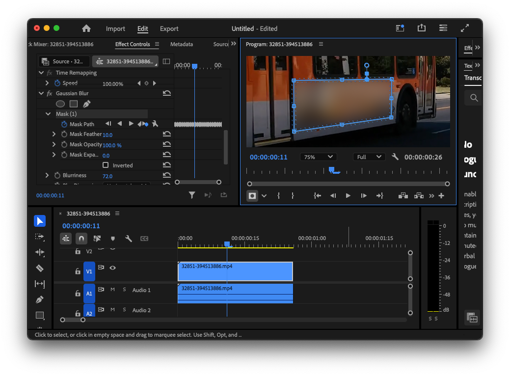

### Instructions
NOTE: This script only works on MacOS.
1. Run the Python script from the Terminal with the command "python3 AE_Mask_To_PP.py".

2. In After Effects, select a keyframed mask and run Mask_To_JSON.jsx from File > Scripts > Run Script File. Copy the contents of the resulting text box to the clipboard.

3. Click "Paste From After Effects" in the Python window. If all went well, you'll see how many keyframes are in the mask.

4. In Premiere, add a mask to the clip attribute or effect you want to apply the After Effects mask to, and add a single keyframe to it. Select the timeline clip and copy it to the clipboard.  

5. Click "Paste from Premiere". If all went well, the name of the copied clip will appear.

6. Click "Click to Copy", and the After Effects mask will be injected into the copied clip, replacing the keyframed mask you added in step 4. Paste this clip back into the timeline, and you're done.

Image credit: Preditorcuts on Pixabay
